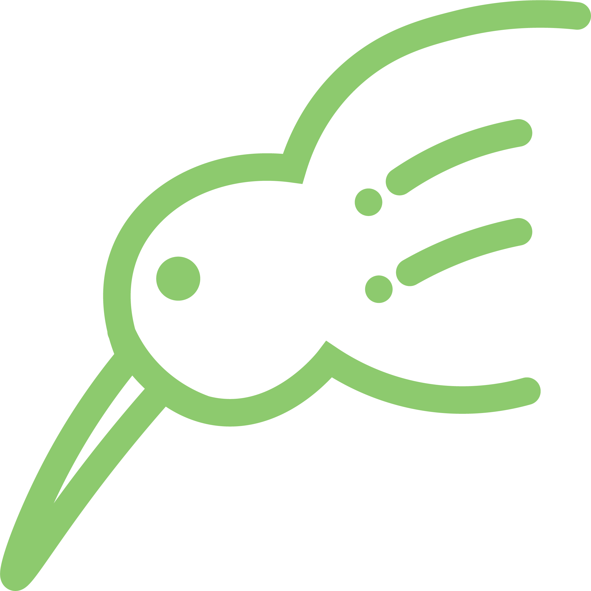

# Kiwisheets

## Build status
| Module      | Status                                                                                                                          |
| ----------- | ------------------------------------------------------------------------------------------------------------------------------- |
| Frontend    |        |
| GQL Server  |    |
| File Server |  |

## Quick start

Note: This stack is designed to run using Docker/Docker swarm mode

Clone this repository recursively to get all submodules

    git clone --recursive https://github.com/kiwisheets/kiwisheets

Make sure to add `--recursive`

For a local development configuration, navigate to `./local-config` and see `.env.example`

    cp .env.example .env

To quickly get up and running, set the following variables inside the `.env` file

`S3_ENDPOINT`,
`AWS_ACCESS_KEY_ID`,
`AWS_SECRET_ACCESS_KEY`,
`S3_REGION`

These are required for the file server to function correctly.

The local config contains a package.json for handling scripts

To start the stack:

    npm run start-dev

To shutdown the stack:

    npm run stop-dev

## Modules
### [Frontend](frontend/README.md)
See the readme for more info
